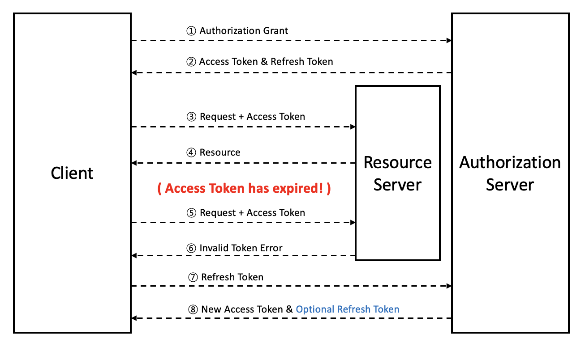

## JWT

: `Json Web Token`의 약자

- 일반적으로 Client와 Server 사이에서 통신할 때 `권한`을 위해 사용
- 웹 표준 통신규약에 따라 생성한 암호화된 토큰

 

## 구성요소

> ### 헤더 (Header)

→ Token에 대한 `메타 데이터`를 포함하고 있음

- 어떤 알고리즘으로 암호화 했는지
- 어떤 토큰을 사용했는지

> ### 페이로드 (Payload)

→ 전달하려는 정보를 포함하고 있음

- 내용 `수정`이 가능하며, 더 많은 `정보`를 추가할 수 있음
- 인증이 필요한 최소한의 정보
  - O → 권한의 범위, 토큰 발급일 및 만료일
  - X → 개인정보

> ### 시그니처 (Signature)

→ 헤더와 정보를 합친 후 발급해준 서버가 지정한 `Secret Key`로 암호화시켜 토큰을 변조하기 어렵게 만듦

 

## JWT의 인증과정

> ### 🔒 Refresh Token을 사용하는 이유
>
> → Access Token을 통한 인증 방식은 제3자에게 탈취 당할 경우 `보안에 취약`하다. Refresh Token은 서버에 저장되기 때문에, Refresh Token이 제3자에게 탈취 당했다고 판단될 때 서버에서 `삭제함`으로써 강제 로그아웃 시킬 수 있다.
>
> ( Access Token은 짧은 만료기간, Refresh Token은 긴 만료기간을 주로 사용한다. )
