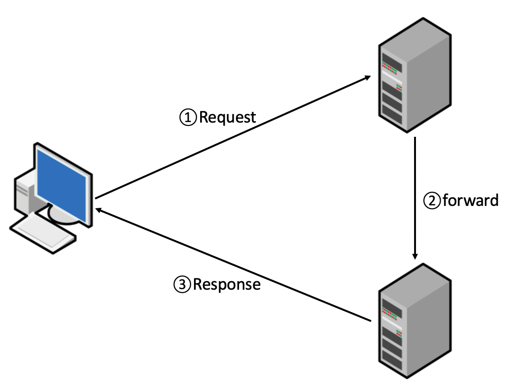

## Forward 방식

&nbsp; Forward는 서버 내부에서 일어나는 호출이다. 웹 브라우저는 다른 페이지로 이동했는지 알 수 없다. 따라서 웹 브라우저에는 호출한 `기존의 URL이 표시`되고, 호출한 페이지와 forward에 의해 호출된 페이지는 `Request 객체`와 `Response 객체`를 공유한다.

### 요약

- Forwarding 후 URL 표시 없이 페이지 이동
- 요청 정보를 그대로 전달
- 시스템에 변화가 생기지 않는 단순 조회 요청에 적합

 

## Redirect 방식

&nbsp; Redirect는 Server에서 Client가 요청한 URL에 대한 응답으로 다른 URL로 재접속하라는 명령을 보내는 것이다. 웹 브라우저는 해당 URL로 이동하게 되고, 새로운 페이지에서 `Request`와 `Response` 객체가 새롭게 생성된다.

### 요약

- 페이지 전환의 주체가 `Client`
- 기존의 `Request 객체`와 `Response 객체`는 유효하지 않음
- 시스템에 변화가 생기는 요청의 경우에 사용 적합

 

---

### 참고자료

- [@kotlinworld](https://kotlinworld.com/329)
- [@doublesprogramming](https://doublesprogramming.tistory.com/m/63)
- [@junhyunny](https://junhyunny.blogspot.com/2019/12/forwarding-redirect.html)
