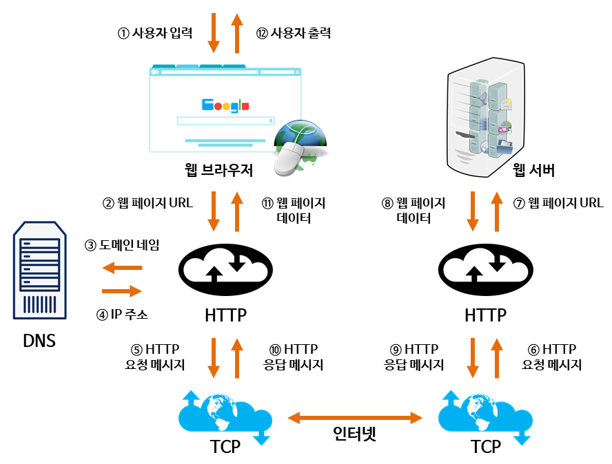

## 웹의 동작원리

 

1. 사용자가 브라우저에 `URL` 입력
2. URL 전송
3. 브라우저는 DNS 서버에 URL의 `도메인 네임` 검색
4. DNS 서버에서 해당 도메인 네임에 해당하는 `IP 주소`를 찾아 사용자가 입력한 URL 정보와 함께 전달
5. HTTP 프로토콜을 사용하여 HTTP 요청 메시지 생성
6. HTTP 요청 메시지는 `해당 IP 주소의 컴퓨터`로 전송됨
7. 도착한 HTTP 요청 메시지가 웹 페이지 `URL` 정보로 변환
8. 웹 서버는 도착한 웹 페이지 URL 정보에 해당하는 `데이터 검색`
9. HTTP 응답 메시지 생성
10. HTTP 응답 메시지는 다시 인터넷을 거쳐 `원래 컴퓨터`로 전송
11. 도착한 HTTP 응답 메시지는 HTTP 프로토콜을 사용하여 `웹 페이지`로 변환
12. `웹 브라우저`로 출력

 

---

### 참고자료

- [@mangkyu](https://mangkyu.tistory.com/91)
- [@wonhee010](https://velog.io/@wonhee010/웹의-동작-원리)
